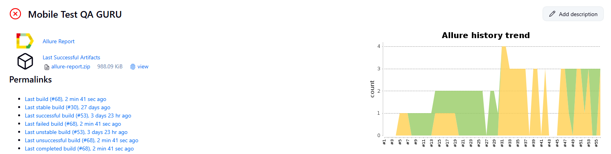
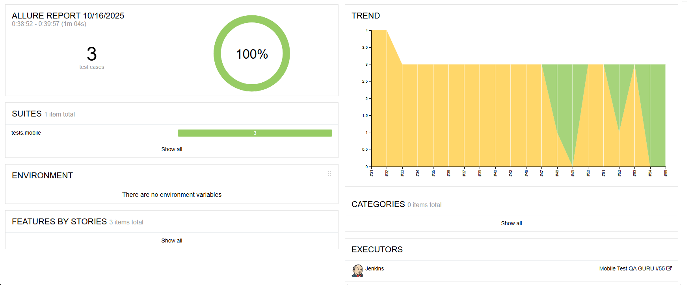

# Mobile Wikipedia — демо-проект по автоматизации (Mobile)
> Тестируемое приложение: Wikipedia (Android)

<p align="center">
  
</p>

## Содержание
> ➠ [Технологический стек](#технологический-стек)  
> ➠ [Покрытый функционал](#покрытый-функционал)  
> ➠ [Jenkins](#jenkins)  
> ➠ [BrowserStack](#browserstack)  
> ➠ [Запуск из терминала](#запуск-из-терминала)  
> ➠ [Allure Report](#allure-report)  
> ➠ [Пример видео прохождения тестов](#пример-видео-прохождения-тестов)

## Технологический стек

<p  align="center">
        
</p>

Автотесты написаны на <code>Python + Pytest</code> с использованием <code>Appium</code> для автоматизации мобильного приложения.  
Запуски выполняются в <code>BrowserStack App Automate</code> (реальные устройства) и локально (эмулятор).  
Сборки идут через <code>Jenkins</code>, отчётность — <code>Allure Report</code>.

## Покрытый функционал
> Мобильные тесты приложения **Wikipedia Android**

- [x] **Онбординг:** `test_onboarding_flow` — проверка экранов и переходов  
- [x] **Поиск и открытие статьи:** `test_open_first_article` — выдача по запросу и переход к первой статье  
- [x] **Подсказки поиска:** `test_wiki_search_suggest` — отображение suggest-вариантов при вводе

## Jenkins
> (пример ссылки на пайплайн) `https://jenkins.autotests.cloud/job/Mobile%20Test%20QA%20GURU/`

<p align="center">
  
</p>
<p align="center"><em>Параметризованные сборки и ссылка на Allure после прогона</em></p>

### Параметризованный запуск (пример)
В <code>Build with Parameters</code> можно задать: тип устройства (реальное/эмулятор), версию Android и региональные настройки.  
После выполнения сборки ссылка на Allure прикрепляется к задаче.

## BrowserStack

Тесты запускаются на реальных устройствах в <code>BrowserStack App Automate</code>.  
Для каждого теста доступны видео, скриншоты и логи устройства.

## Запуск из терминала

Локально:
```bash
python -m venv .venv && source .venv/bin/activate    # Windows: .venv\Scripts\activate
pip install -r requirements.txt
pytest -m "mobile" -q
```

Локальная генерация отчёта:
```bash
allure serve allure-results
```

## Allure Report
> (пример ссылки на отчёт) `https://jenkins.autotests.cloud/job/Mobile%20Test%20QA%20GURU/55/allure/`

<p align="center">
  
</p>

## Пример видео прохождения тестов

<p align="center">
  
</p>
